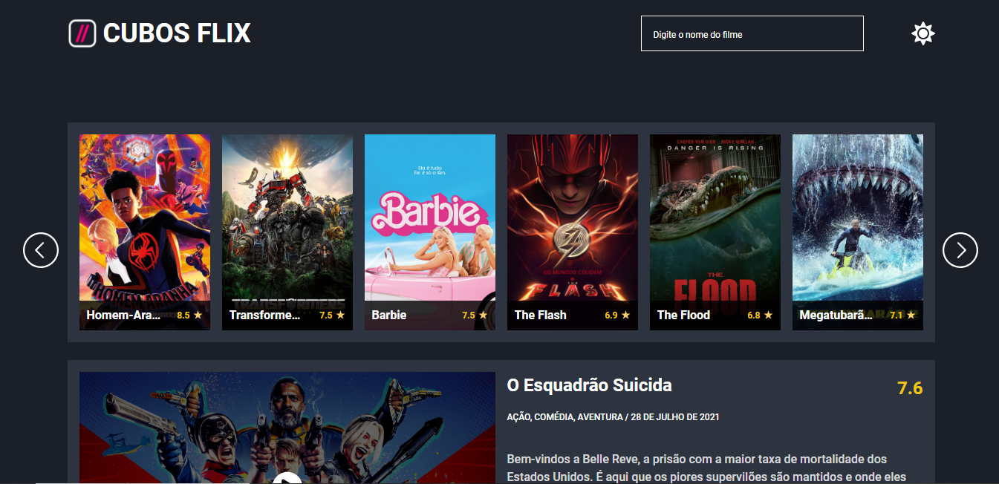
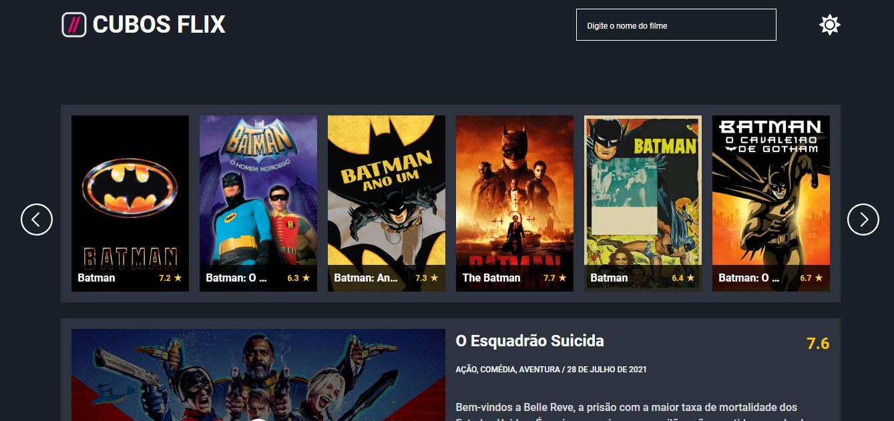
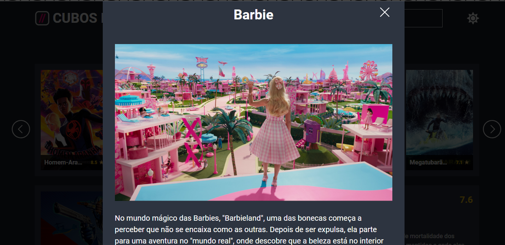

# API-axios
Busca de filmes por título.

# Visão Geral
A CUBOSFLIX é uma página web que permite aos usuários explorar informações sobre filmes a partir de uma API. Ele oferece uma interface amigável para pesquisar filmes, visualizar detalhes, assistir trailers e descobrir informações relevantes sobre os filmes. O projeto foi construído com JavaScript, HTML e CSS, fazendo uso da biblioteca Axios para realizar chamadas à API.

# Recursos
Busca de filmes por título. 
Listagem de filmes em destaque. 
Exibição de informações detalhadas do filme. 
Reprodução de trailers de filmes. 
Alternância entre temas claro e escuro.

# Instalação
✨Clone este repositório para o seu ambiente local. 
✨Navegue até a pasta do projeto e abra o arquivo "index.html" em um navegador web. 
✨O aplicativo será carregado e você poderá começar a explorar os filmes. 

 
_Página principal exibindo a lista de filmes em destaque._

 
_Pesquisa de filmes na barra de pesquisa._

 
_Resultado da pesquisa exibindo uma lista de filmes correspondentes.

 
_Modal aberto exibindo detalhes adicionais sobre um filme selecionado._
